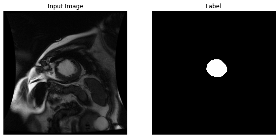
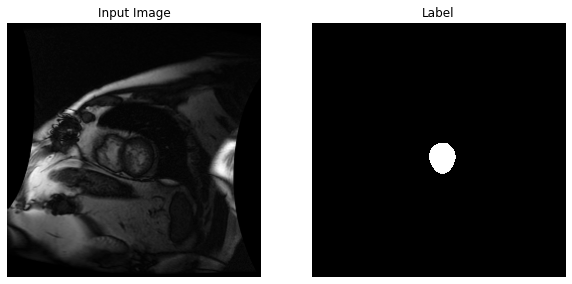
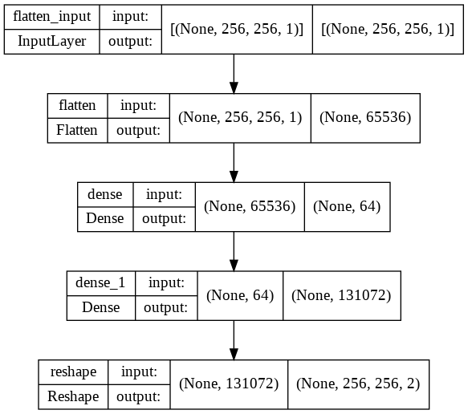
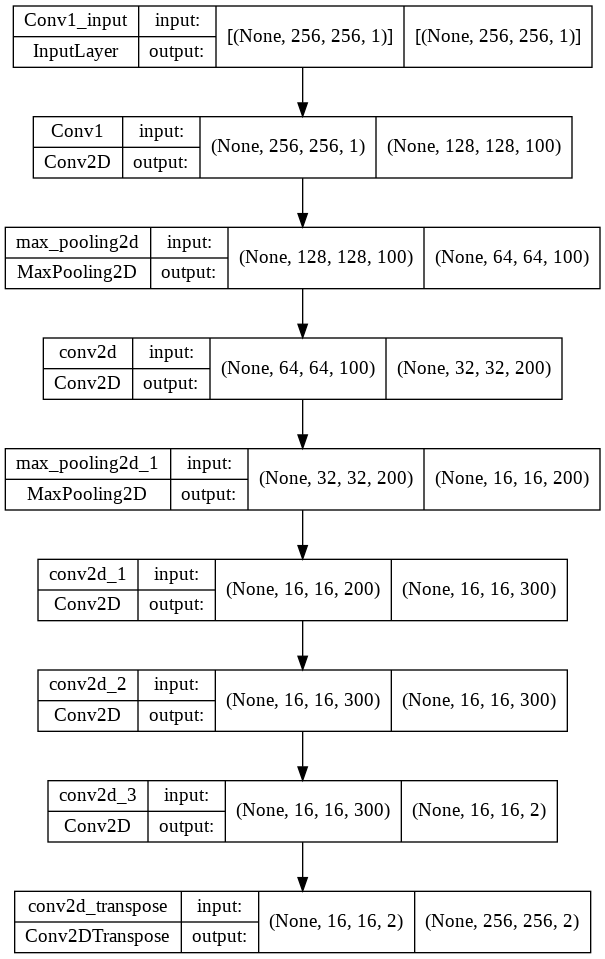

# MRI-Segmentation
Simple Image segmentation using Fully connected neural network and Conv Net. 

The hierarchy of this project goes as follows
1. Preparation of the dataset using tensorflow records
2. Building the tensorflow keras network using various built-in network components
3. Setting the parameters for training
4. Training the model for set number of epochs
5. Evaluation of the trained network

This project was accomplished as a part of Nvidia's DLI course on Image Segmentation. This project was initially a part of Kaggle's competition where in the actual task was to predict the volume of left ventricle of the heart during the systole and distole. But here we will be focusing majorly on the image segmentation part.

# Dataset
As a part of the DLI course , the data was handed over to me in the form of the TFRecord , where in the DICOM format MRI scans were processed and were finally stored as TFRecords.
Training Images:234
Validation Images:26

I definetly have plans to cover the data prepartion part as it forms a import part of the machine learning pipeline. And maybe if time permits I'll extend the image segmentation to the ventricle volume prediction task.

Images after processing looks something like this

# Networks
As mentioned in the initial part , I have 2 networks namely a simple neural network and a Convolutional network which resembles the same as shown below

